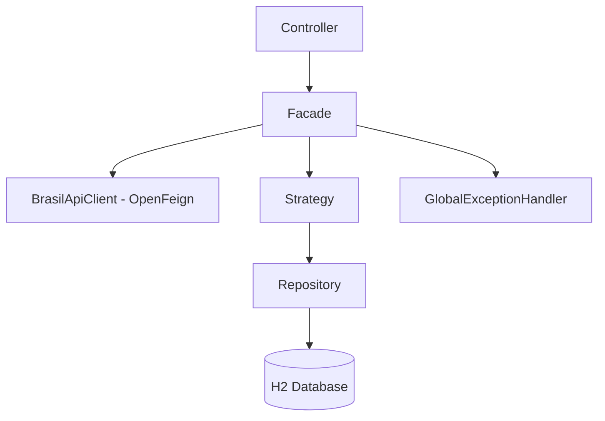

# 🏢 Cliente CNPJ API

REST API built with Spring Boot that talks to the [BrasilAPI](https://brasilapi.com.br) CNPJ web service and stores the results in an H2 database. The project applies the Singleton, Strategy and Facade design patterns and offers a full CRUD with proper HTTP verbs, meaningful status codes and centralized error handling.

## 🚀 Tecnologias

- **Java 21**
- **Spring Boot 3.3.5**
- **Spring Web** e **Spring Data JPA**
- **Bean Validation**
- **H2 Database**
- **OpenFeign**
- **OpenAPI / Swagger**
- **Maven**

## 🧠 Padrões de Projeto

- **Singleton** — os serviços são beans do Spring e, por padrão, existe uma única instância de cada.
- **Strategy** — `EmpresaStrategy` define como uma empresa é salva e atualizada (`salvar` / `atualizar`). A implementação atual é `SalvarEmpresaStrategy`, que pode ser substituída sem mexer no Facade.
- **Facade** — `EmpresaFacade` reúne o fluxo entre Controller, Feign Client (BrasilAPI), Strategy e Repository, expondo ao Controller operações simples.

## 📂 Arquitetura



## 🌐 Endpoints

| Verbo  | Rota               | O que faz                                                    | Sucesso | Erros              |
|--------|--------------------|--------------------------------------------------------------|---------|--------------------|
| POST   | `/empresas/{cnpj}` | Consulta a BrasilAPI e **cadastra** a empresa localmente     | 201     | 400, 404, 409, 503 |
| GET    | `/empresas/{cnpj}` | Retorna uma empresa **já cadastrada** (não grava nada)       | 200     | 400, 404           |
| GET    | `/empresas`        | Lista as empresas cadastradas (`?page=&size=&sort=`)         | 200     | -                  |
| PUT    | `/empresas/{cnpj}` | Atualiza manualmente os dados de uma empresa existente       | 200     | 400, 404           |
| DELETE | `/empresas/{cnpj}` | Remove uma empresa cadastrada                                | 204     | 400, 404           |

> O `GET` nunca altera dados. A criação, que tem efeito colateral, só acontece pelo `POST`, seguindo a semântica do HTTP.

O CNPJ vale com ou sem máscara, mas como a `/` da máscara precisa ser codificada (`%2F`) na URL, o mais simples é enviar só os números. Antes de chamar a BrasilAPI, a API confere o formato e os dígitos verificadores (CNPJ alfanumérico também é aceito).

**Exemplos de chamadas:**
```
POST   http://localhost:8080/empresas/00000000000191
GET    http://localhost:8080/empresas/00000000000191
GET    http://localhost:8080/empresas?page=0&size=10&sort=razaoSocial
PUT    http://localhost:8080/empresas/00000000000191
DELETE http://localhost:8080/empresas/00000000000191
```

**Corpo do PUT** (obrigatórios: `razaoSocial`, `municipio` e `uf`):
```json
{
  "razaoSocial": "BANCO DO BRASIL SA",
  "nomeFantasia": "DIRECAO GERAL",
  "situacaoCadastral": "ATIVA",
  "logradouro": "SAUN QUADRA 5 LOTE B",
  "numero": "S/N",
  "bairro": "ASA NORTE",
  "municipio": "BRASILIA",
  "uf": "DF",
  "cep": "70040912",
  "telefone": "6134939002",
  "email": "contato@exemplo.com.br"
}
```

**Formato das respostas de erro** (exemplo de 404):
```json
{
  "timestamp": "2026-10-01T10:00:00",
  "status": 404,
  "error": "Not Found",
  "message": "Nenhuma empresa cadastrada para o CNPJ 00000000000191",
  "path": "/empresas/00000000000191"
}
```

## ⚠️ Tratamento de Erros

O `GlobalExceptionHandler` (`@RestControllerAdvice`) traduz cada exceção para o status HTTP correto:

- `CnpjInvalidoException` → **400** (formato ou dígito verificador inválido)
- `MethodArgumentNotValidException` → **400** (corpo do PUT inválido, com a lista `details`)
- `RecursoNaoEncontradoException` → **404** (CNPJ não cadastrado ou inexistente na BrasilAPI)
- `EmpresaJaExisteException` → **409** (POST de um CNPJ que já existe)
- `BrasilApiIndisponivelException` → **503** (falha ao falar com a BrasilAPI, inclusive limite de requisições)
- Qualquer outra exceção → **500**, sem expor stacktrace ao cliente

## 📖 Swagger e H2

- Swagger UI: `http://localhost:8080/swagger-ui.html`
- Console do H2: `http://localhost:8080/h2-console`
  - JDBC URL: `jdbc:h2:mem:testdb`
  - Usuário: `sa` · Senha: (vazia)

## ⚙️ Como Executar

É necessário ter Java 21 e Maven.

```bash
mvn spring-boot:run
```

Também dá para rodar a classe `ClienteCnpjApiApplication` direto pela IDE. O `POST` precisa de internet para consultar a BrasilAPI.

## 🧪 Testes

```bash
mvn test
```

`EmpresaControllerTest` (`@WebMvcTest` + `MockMvc`) cobre os cinco endpoints e os principais erros, e `CnpjUtilsTest` cobre a validação do CNPJ.

## 🔮 Próximos Passos

- 🔐 Autenticação com Spring Security / JWT
- 📦 Cache com Redis para evitar consultas repetidas à BrasilAPI
- 🗃 Migração para PostgreSQL + Flyway
- 📊 Spring Boot Actuator, logs estruturados e métricas
- 🔗 HATEOAS nas respostas
- 🔢 Versionamento da API (`/v1/...`)
- 🧪 Testcontainers para testes com banco real

## 🎯 Objetivo Acadêmico

Projeto criado para praticar padrões de projeto, integração com um web service externo, organização em camadas e boas práticas de APIs REST (verbos e status corretos, DTOs separados da entidade, erros centralizados e validação de entrada).

## 👩‍💻 Autora

Julia Akemi — projeto desenvolvido para fins acadêmicos com Spring Boot.
